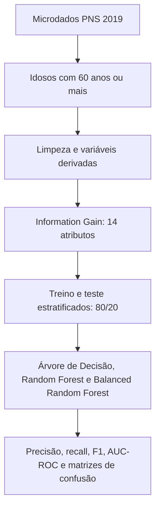

# DPOC em idosos brasileiros: fatores associados e perfil nutricional

### Uma análise dos microdados da Pesquisa Nacional de Saúde (PNS) 2019

**Walker Junio Gonzaga Rocha**

[**Ler o artigo completo (PDF)**](Relatorio_Final_DPOC_Idosos_PNS_2019.pdf)

## Sobre o estudo

Este trabalho investiga **fatores associados ao diagnóstico médico autorreferido de Doença Pulmonar Obstrutiva Crônica (DPOC)** entre pessoas com **60 anos ou mais** no Brasil. Foram analisados os microdados da **PNS 2019** com modelos de classificação e medidas apropriadas para uma classe positiva rara. O estudo também explora a relação entre DPOC e características nutricionais, como **IMC e peso corporal**.

> **Escopo:** esta é uma análise exploratória de dados populacionais. As associações e previsões descritas aqui não estabelecem causalidade e não servem para diagnóstico clínico.

## Principais números

| Etapa | Resultado |
| --- | ---: |
| Pessoas com 60 anos ou mais na seleção inicial | **21.968** |
| Diagnóstico de DPOC autorreferido na seleção inicial | **582 (2,65%)** |
| Registros após limpeza, usados na modelagem | **19.417** |
| Casos positivos na base de modelagem | **558 (2,87%)** |
| Variáveis preditoras mantidas pelo Information Gain | **14** |

Os totais das duas etapas são diferentes porque registros incompletos nas variáveis usadas nos modelos foram removidos antes da modelagem.

## Como a análise foi feita

- **Alvo:** resposta à variável `Q11604` da PNS, convertida em `DPOC=1` para diagnóstico médico autorreferido de bronquite crônica, enfisema pulmonar ou DPOC e `DPOC=0` para resposta negativa.
- **Preparação:** seleção dos idosos, tratamento dos registros incompletos, codificação de variáveis categóricas e criação de indicadores como IMC e faixa etária.
- **Seleção:** Information Gain de Shannon, com limiar `IG ≥ 0,0003`, aplicado na distribuição original dos dados.
- **Treinamento:** divisão estratificada em 80% para treino e 20% para teste; Random Under-Sampling aplicado **somente ao treino** na comparação inicial. A avaliação usou o conjunto de teste com a distribuição original das classes.
- **Experimento complementar:** comparação com Balanced Random Forest e ajuste dos limiares de decisão.

## Resultados

Na comparação complementar descrita no artigo:

| Critério | Modelo | Precisão DPOC=1 | Recall DPOC=1 | F1 DPOC=1 | AUC-ROC |
| --- | --- | ---: | ---: | ---: | ---: |
| Maior F1 da classe positiva | **Random Forest**, limiar 0,4 | **0,2892** | 0,2143 | **0,2462** | 0,7156 |
| Maior AUC-ROC | **Balanced Random Forest**, limiar 0,7 | 0,1585 | 0,3482 | 0,2179 | **0,7189** |

O Balanced Random Forest com limiar 0,2 alcançou recall de **0,9821**, mas apresentou precisão de apenas **0,0299** e muitos falsos positivos. Por isso, o artigo considera o **Random Forest com limiar 0,4** o melhor equilíbrio para a classe positiva segundo o F1-score, sem sugerir uso clínico do modelo.

As variáveis com maior destaque nos modelos foram o diagnóstico autorreferido de **asma/bronquite asmática (`Q074`)**, **IMC**, **peso (`P00104`)**, **idade (`C008`)** e **frequência de consumo de frutas (`P018`)**. São associações observadas nos dados, não efeitos causais demonstrados.

## Limitações e próximos passos

- O desfecho é **autorreferido** e não foi confirmado por espirometria.
- A PNS é transversal; os resultados não demonstram relações de causa e efeito.
- A avaliação do artigo usa uma única divisão de treino e teste, sem validação externa nem intervalos de confiança.
- **Ponto metodológico a reavaliar:** o Information Gain foi calculado antes da divisão treino/teste, como descrito no artigo. Uma reprodução futura deve calcular a seleção apenas nos dados de treino e reavaliar as métricas, para evitar possível vazamento de informação do teste.
- O desbalanceamento da base torna necessária a leitura conjunta de precisão, recall, F1-score e falsos positivos.

## Arquivos deste repositório

| Arquivo | Conteúdo |
| --- | --- |
| [`Relatorio_Final_DPOC_Idosos_PNS_2019.pdf`](Relatorio_Final_DPOC_Idosos_PNS_2019.pdf) | Texto integral, metodologia, tabelas, gráficos, discussão e referências. |
| `README.md` | Resumo para navegação rápida. |

O repositório apresenta **o relatório e os resultados publicados nele**. Os scripts, o ambiente de execução e os microdados tratados não acompanham esta versão; portanto, o README descreve o procedimento, mas não promete reprodução executável imediata.

**Autoria:** Walker Junio Gonzaga Rocha · Projeto de pesquisa em Ciência de Dados e Inteligência Artificial, PUC Minas.
